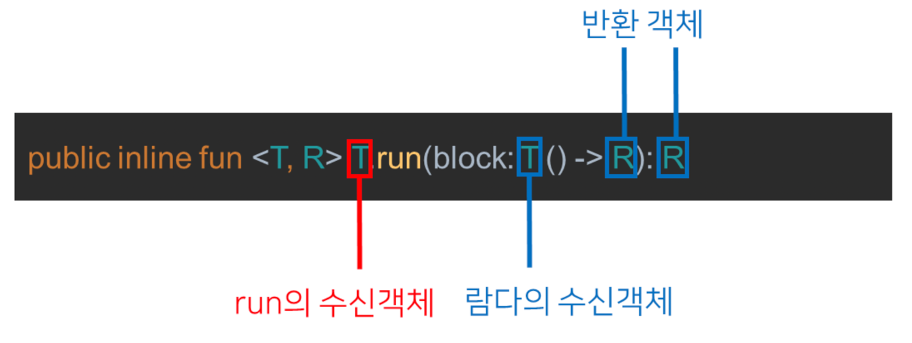

# SpringBoot + Kotlin 예제 프로젝트

## 이슈 등록 API

### Controller
```kotlin
@PostMapping
fun create(
    authUser: AuthUser,
    @RequestBody request: IssueRequest,
) 
```

### Service
```kotlin
@Transactional
fun create(userId: Long, request: IssueRequest) : IssueResponse {

    val issue = Issue(
        summary = request.summary,
        description = request.description,
        userId = userId,
        type = request.type,
        priority = request.priority,
        status = request.status,
    )
    return IssueResponse(issueRepository.save(issue))
}
```

### Repository
```kotlin
interface IssueRepository : JpaRepository<Issue, Long> {
    fun findAllByStatusOrderByCreatedAtDesc(status: IssueStatus) : List<Issue>?
}
```

### Request, Response data class
```kotlin
/**
 * IssueRequest
 */
data class IssueRequest(
    val summary: String,
    val description: String,
    val type: IssueType,
    val priority: IssuePriority,
    val status: IssueStatus,
)

/**
 * IssueResponse
 */
data class IssueResponse(
    val id: Long,
    val comments: List<CommentResponse> = emptyList(),
    val summary: String,
    val description: String,
    val userId: Long,
    val type: IssueType,
    val priority: IssuePriority,
    val status: IssueStatus,
    @JsonFormat(pattern = "yyyy-MM-dd HH:mm:ss")
    val createdAt: LocalDateTime?,
    @JsonFormat(pattern = "yyyy-MM-dd HH:mm:ss")
    val updatedAt: LocalDateTime?,
) {

    companion object {

        operator fun invoke(issue: Issue) =
            /* with 를 사용해서 issue.xx 생략 */
            with(issue) {
                IssueResponse(
                    id = id!!,
                    comments = comments.sortedByDescending(Comment::id).map(Comment::toResponse),
                    summary = summary,
                    description = description,
                    userId = userId,
                    type = type,
                    priority = priority,
                    status = status,
                    createdAt = createdAt,
                    updatedAt = updatedAt,
                )
            }

    }

}
```

# 

## 사용한 문법 정리

### 1) sealed class
- 컴파일러는 부모 클래스를 상속받은 자식 클래스들의 존재를 알지 못하는데, sealed class를 사용하면 자식 클래스의 존재를 알게되어 제한하는 특성을 가진다.

```kotlin
sealed class HyundaiCar(
    val name: String,
    val price: Long
)

// 추상화가 필요한 Entity or DTO에 sealed Class 를 활용한다.
private fun handleCar(car: HyundaiCar) {
    when (car) {
        is Avante -> TODO()
        is Grandeur -> TODO()
        is Sonata -> TODO()
        // else 를 사용하지 않아도 된다. 컴파일러가 자식클래스를 알고있기 때문이다.
    }
}
```

### 2) run
- 수신 객체를 리턴하지 않고, run 블록의 마지막 라인을 return하는 범위 지정 함수다.
- 수신객체에 대해 특정한 동작을 수행한 후 결과값을 리턴받아야할 경우 사용한다.
- 수신객체 접근은 `it`을 사용한다.

```kotlin
@Transactional
fun edit(id: Long, userId: Long, request: CommentRequest): CommentResponse? {
    // id 와 userId 가 매핑되는 경우에만 수정 가능
    // 안전연산자 run
    return commentRepository.findByIdAndUserId(id, userId)?.run {
        body = request.body
        commentRepository.save(this).toResponse()
    }
}
```


###### 출처 : https://kotlinworld.com/255

### 3) let
- 수신객체를 이용해 작업한 후 마지막 줄을 return 할때 사용한다.
- null을 체크하려면 `?.let`을 사용하는데, 이때 let의 block은 수신객체가 null이 아닌 경우에만 수행된다.

```kotlin
@Transactional
fun delete(issueId: Long, id: Long, userId: Long) {
    val issue = issueRepository.findByIdOrNull(issueId) ?: throw NotFoundException("이슈가 존재하지 않습니다")
    // 람다 사용 let
    // 조회된 comment 객체
    commentRepository.findByIdAndUserId(id, userId)?.let { comment->
        issue.comments.remove(comment)
    }
}
```

### 4) data class
- data class : equals, hashCode, toString 자동으로 만들어준다.

```kotlin
data class PersonDto ( // data 키워드 : equals, hashCode, toString 자동으로 만들어준다.
    // name arguments 사용하면 builder 와 같은 효과도 얻을 수 있다.
    val name:String,
    val age: Int
    ) {
}
```

### 5) companion method
- 해당 블록 안에는 모두 static으로 선언된다.
- const : 컴파일시에 변수가 할당된다. 상수에 사용하기 위한 용도로, 기본타입과 String에 붙일 수 있다.
- 코틀린에서는 static 키워드가 없고 companion object 를 사용한다.

```kotlin
class Person private constructor(
    var name: String,
    var age: Int
) {
    // static : 클래스가 인스턴스화 될때 새로운 값이 복제되는것이 아니라 정적으로 인스턴스끼리의 값을 공유한다.
    // companion objedct : 클래스와 동행하는 유일한 오브젝트 (동반객체도 하나의 객체로 간주된다. 이름을 붙일 수 있고, interface를 구현할수도 있다.)
    // kotlin 에는 static이 없다. companion object 라고 해야한다.
    companion object Factory : Log { // 해당 블록 안에는 모두 static 으로 선언된다.
        // const : 컴파일시에 변수가 할당된다. (상수에 붙이기 위한 용도, 기본 타입과 String에 붙일 수 있음)
        // 기본 val : 런타임시에 변수가 할당된다.
        const val MIN_AGE = 1

        fun newBaby(name: String): Person {
            return Person(name, MIN_AGE)
        }

        override fun log() {
            println("나는 Person 클래스의 동행 객체입니다.")
        }

        // 유틸성 함수들을 넣어도 되지만, 최상단 파일을 활용하는 것을 추천한다.
    }
}
```

### 6) with
- with를 사용하여 어떤 객체의 이름을 반복하지 않고도 그 객체에 대해 다양한 연산을 수행할 수 있다.
- 수신객체 접근은 `it`을 사용한다.

```kotlin
fun alphabet2() : String {
    val stringBuilder = StringBuilder()

    /* 파라미터는 2개다. 첫번째는 StringBuilder, 두번째 람다 */
    return with(stringBuilder) { /* 메서드를 호출하려는 수신 객체를 지정한다. */
        for (letter in 'A'..'Z') {
            this.append(letter)  /* this를 명시해서 앞에서 지정한 수신 객체의 메서드를 호출한다. */
        }

        append("\nNow I know the alphabet!")  /* "this"를 생략하고 메서드를 호출한다. */
        this.toString() /* 람다에서 값을 반환한다. */
    }
}
```

### 7) apply
- apply의 수신 객체가 전달받은 람다의 수신 객체가 된다.
- 이 함수에서 apply를 실행한 결과는 StringBuilder 객체다. 그 객체의 toString을 호출해서 String 객체를 얻는다.

```kotlin
fun alphabet() = StringBuilder().apply {
    for (letter in 'A'..'Z'){
        append(letter)
    }

    append("\nNow I know the alphabet!")
}.toString()

fun main(args: Array<String>) {
    println(alphabet())
}
```