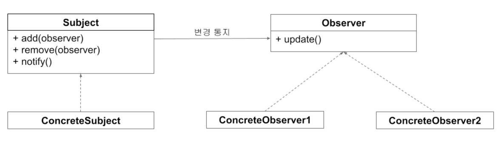

# 리액티브 프로그래밍 - 옵저버 패턴

## 옵저버 패턴

- 옵저버 패턴(Observer Pattern) 이란 GoF가 소개한 디자인 패턴 중 하나로 관찰 대상이 되는 객체가 변경되면 대상 객체를 관찰하고 있는 `옵저버(Observer)`에게 변경사항을 통지(notify)하는 디자인 패턴을 말한다
- 옵저버 패턴을 사용하면 객체 간의 상호작용을 쉽게 하고 효과적으로 데이터를 전달할 수 있다

### 옵저버 패턴의 구조

- 옵저버 패턴은 관찰 대상인 서브젝트(Subject) 와 Subject를 관찰하는 옵저버(Observer) 로 이뤄져 있다.
- 하나의 Subject에는 1개 또는 여러 개의 Objeserver를 등록할 수 있다.
- Subject의 상태가 변경되면 자신을 관찰하는 Objeserver들에게 변경사항을 통지한다.
- Subject로 변경사항을 통지 받은 Objeserver는 부가적인 처리를 한다.



- 옵저버 패턴은 서브젝트와 옵저버를 상속하는 구체화(Concrete) 클래스가 존재한다.
- 구체화 클래스는 서브젝트와 옵저버에 대한 상세 구현을 작성한다.

# 

## 옵저버 패턴 구현

- JDK 1.0 부터 포함된 Observable 클래스와 Observer 인터페이스를 사용한 간단한 예제 구현

```kotlin
package observerpattern
import java.util.*

class Coffee(val name: String)

// Subject
class Barista : Observable() {
    private lateinit var coffeeName: String
    
    fun orderCoffee(name: String) {
        this.coffeeName = name
    }
    
    fun makeCoffee() {
        setChanged()
        notifyObservers(Coffee(this.coffeeName))
    }
}

// Observer
class Customer(val name: String) : Observer {
    /**
     * 구현 메서드
     */
    override fun update(o: Observable?, arg: Any?) {
        val coffee = arg as Coffee
        println("${name}이 ${coffee.name}을 받았습니다")
    }
}

fun main() {
    val barista = Barista()
    barista.orderCoffee("아이스 아메리카노")
    
    val customer = Customer("고객1")
    
    barista.addObserver(customer)
    barista.makeCoffee()
}
// 고객1이 아이스 아메리카노을 받았습니다
```

- Customer 클래스는 Observer 인터페이스를 구현하여 Barista 클래스가 커피를 완성하면 통지를 받아서 update 함수에서 처리한다.
- Barista 클래스는 Observable 클래스를 상속하여 고객이 주문한 커피가 만들어지면 notifyObservers로 고객에게 만들어진 Coffee 객체를 전달한다. 
- 이때 setChanged를 먼저 호출하여 변경 여부를 내부에 저장한다
- Customer 클래스가 Barista 클래스를 관찰하기 위해 addObserver로 등록한다

#### 옵저버(고객)를 추가로 등록한 경우
```kotlin
package observerpattern
import java.util.*

class Coffee(val name: String)

// Subject
class Barista : Observable() {
    private lateinit var coffeeName: String
    
    fun orderCoffee(name: String) {
        this.coffeeName = name
    }
    
    fun makeCoffee() {
        setChanged()
        notifyObservers(Coffee(this.coffeeName))
    }
}

// Observer
class Customer(val name: String) : Observer {
    override fun update(o: Observable?, arg: Any?) {
        val coffee = arg as Coffee
        println("${name}이 ${coffee.name}을 받았습니다")
    }
}

fun main() {
    val barista = Barista()
    barista.orderCoffee("아이스 아메리카노")
    
    val customer = Customer("고객1")
    val customer2 = Customer("고객2")
    val customer3 = Customer("고객3")
    
    barista.addObserver(customer)
    barista.addObserver(customer2)
    barista.addObserver(customer3)
    
    barista.makeCoffee()
}
// 고객3이 아이스 아메리카노을 받았습니다
// 고객2이 아이스 아메리카노을 받았습니다
// 고객1이 아이스 아메리카노을 받았습니다
```

# 

## 옵저버 패턴의 장점

- 옵저버 패턴을 사용하지 않았을때의 단점은 아래와 같다.
  - 옵저버 패턴을 사용하지 않았다면 고객은 일정 간격으로 커피가 완성됐는지 바리스타에게 확인하는 처리가 있어야 함
  - 간격이 너무 짧으면 변경된 상태를 빠르게 확인할 수 있지만 매번 불필요한 호출이 발생하므로 성능상 문제가 발생할 수 있음
  - 또한 간격이 너무 길면 변경된 상태를 즉시 확인할 수 없으므로 실시간성이 떨어질 수 있다.
- 옵저버 패턴은 관찰자인 옵저버가 서브젝트의 변화를 신경 쓰지 않고 상태 변경의 주체인 서브젝트가 변경사항을 옵저버에게 알려줌으로써 위 문제를 해결할 수 있다.
- 옵저버 패턴은 데이터를 제공하는 측에서 데이터를 소비하는 측에 통지하는 푸시 (Push-Based) 방식이다.
- 옵저버 패턴에서 서브젝트와 옵저버는 관심사에 따라 역할과 책임이 분리되어 있다.
  - 서브젝트는 옵저버가 어떤 작업을 하는지 옵저버의 상태가 어떤지에 대해 관심을 가질 필요가 없고 오직 변경 사항을 통지하는 역할만 수행하고,
    하나 혹은 다수의 옵저버는 각각 맡은 작업을 스스로 하기 때문에 옵저버가 하는 일이 서브젝트에 영향을 끼치지 않고 옵저버는 단순한 데이터의 소비자로서 존재하게 된다.

