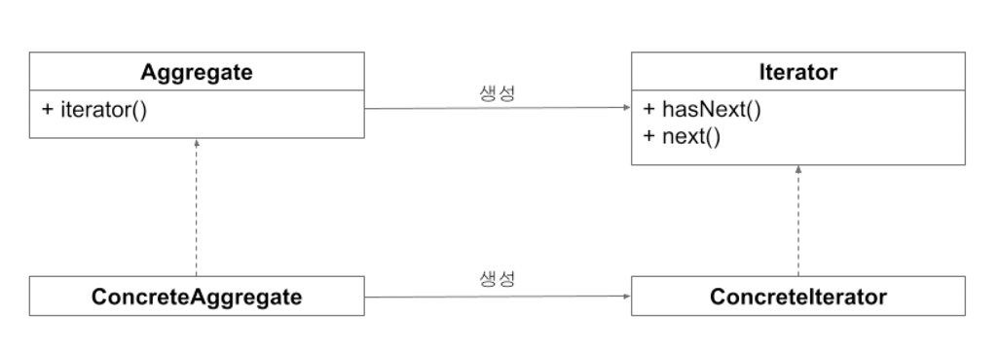

# 리액티브 프로그래밍 - 이터레이터 패턴

## 이터레이터 패턴

- 이터레이터 패턴(Iterator Pattern) 은 데이터의 집합에서 데이터를 순차적으로 꺼내기 위해 만들어진 디자인 패턴을 말함
- 이터레이터 패턴을 사용하면 컬렉션이 변경되더라도 동일한 인터페이스를 사용해 데이터를 꺼내올 수 있기 때문에 변경사항 없이 사용할 수 있다
- 데이터의 집합이 얼만큼의 크기를 가진지 알 수 없는 경우 이터레이터 패턴을 사용하면 순차적으로 데이터를 꺼내올 수 있다



- 애그리게잇(Aggregate) 은 요소들의 집합체를 나타낸다
- 이터레이터는 집합체 내부에 구현된 iterator를 이용해 생성한다
- 이터레이터를 사용하는 클라이언트는 생성된 이터레이터의 `hasNext 함수`를 사용해 데이터가 존재하는지 검사하고 `next 함수`를 사용해 데이터를 꺼낸다

<br/>

## 이터레이터 패턴 구현

```kotlin
package iteratorpattern

data class Car(val brand: String)

class CarIterable(val cars: List<Car> = listOf()) : Iterable<Car> {
    override fun iterator() = CarIterator(cars)
}

class CarIterator(val cars: List<Car> = listOf(), var index: Int = 0)
    : Iterator<Car> {
    override fun hasNext() = cars.size > index
    override fun next() = cars[index++]
}

fun main() {
    val carIterable = CarIterable(listOf(Car("람보르기니"), Car("페라리")))
    val iterator = carIterable.iterator()
    while (iterator.hasNext()) {
        println("브랜드 : ${iterator.next()}")
    }
}
```

- CarIterable 클래스는 Iterable 인터페이스를 구현하여 CarsIterator 를 생성하는 iterator 함수를 오버라이드 한다.
- CarIterator 클래스는 Iterator 인터페이스를 구현하여 데이터가 존재하는지 확인하는 `hasNext` 메서드를 오버라이드 한다.
- 데이터가 존재하면 데이터를 가져오는 `next 함수`를 오버라이드 한다.
- while문 내부에선 hasNext를 사용하여 데이터를 모두 가져올때까지 반복하고 데이터를 출력한다.

<br/>

## 옵저버 패턴과 차이점

- 데이터를 제공한다는 관점에서 이터레이터 패턴과 옵저버 패턴은 유사하다.
- `이터레이터 패턴`은 에그리게잇이 내부에 데이터를 저장하고 이터레이터를 사용해 데이터를 순차적으로 당겨오는 방식이기 때문에 `풀 기반(Pull-Based)`이다.
- 이에 반해 `옵저버 패턴`은 데이터 제공자가 소비하는 측에 데이터를 통지하는 `푸시 기반`이라는 점이 차이점이다.


