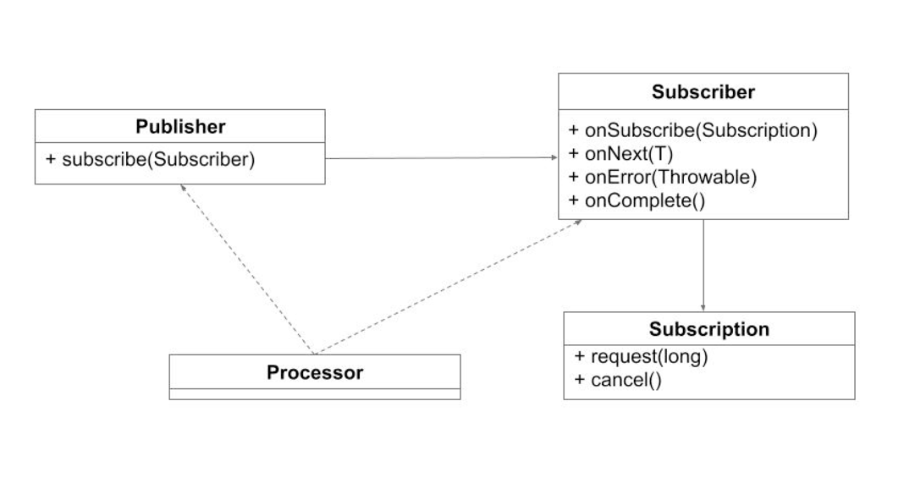
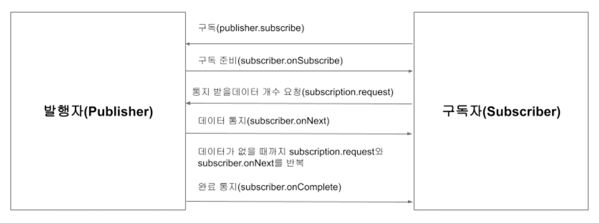

# 리액티브 프로그래밍 기초

## 리액티브 프로그래밍이란

- 리액티브 프로그래밍(Reactive Programming) 은 데이터 또는 이벤트의 변경이 발생하면 이에 반응해 처리하는 프로그래밍 기법을 말한다
- 리액티브 프로그래밍은 비동기 프로그래밍을 처리하는 새로운 접근 방식
- 2010년 에릭 마이어에 의해 마이크로소프트 .NET 에코 시스템으로 정의됨
- 리액티브 프로그래밍은 데이터의 통지, 완료, 에러에 대한 처리를 옵저버 패턴에 영감을 받아 설계되었고 데이터의 손쉬운 비동기 처리를 위해 함수형 언어의 접근 방식을 사용

### 리액티브 프로그래밍 이전의 비동기 프로그래밍

- 리액티브 프로그래밍이 나오기 전 비동기 프로그래밍은 대부분 콜백 기반의 비동기 처리 방식을 사용했다.

```kotlin
fetch("/api/users/me") { user->
    fetch("/api/users/${user.id}/followers") { followers ->
        fetch("/api/users/${user.id}/likes") { likes ->
            fetch("/api/users/${user.id}/contacts") { contacts ->
                // 콜백 헬
            }
        }
    }
}
```

- 간단한 콜백은 이해하기 쉬울 수 있지만 콜백이 많아져서 발생하는 `콜백 헬(Callback Hell)`로 인해 코드의 복잡도가 늘어난다

### 리액티브 프로그래밍을 적용한 사례

- 리액티브 프로그래밍을 사용하면 콜백 헬 문제를 함수형 프로그래밍 관점으로 해결할 수 있다
- 콜백 헬 없이 비동기 코드를 쉽게 작성할 수 있기 때문에 서버나 UI 애플리케이션 개발시 리액티브 프로그래밍이 유용하게 사용되고 있다

```kotlin
fetchReactive("/api/users/me")
    .zip { user -> fetchReactive("/api/users/${user.id}/followers") }
    .zip { user -> fetchReactive("/api/users/${user.id}/likes") }
    .zip { user -> fetchReactive("/api/users/${user.id}/contacts") }
    .flatMap { followers, likes, contacts ->
    // 로직 구현
}
```

# 

## 리액티브 스트림

- 리액티브 스트림(Reactive Stream)은 **리액티브 프로그램의 표준 API 사양**을 말한다.
- 비동기 데이터 스트림과 논-블로킹 백프레셔(Back-Pressure)에 대한 사양을 제공한다.
- 리액티브 스트림 이전의 비동기식 애플리케이션에서는 CPU의 멀티 코어를 제대로 활용하기 위해 복잡한 병렬 처리 코드가 필요했다.
- 기존의 방식은 처리할 데이터가 무한정 많아져서 시스템의 한계를 넘어서는 경우 애플리케이션은 병목 현상(bottleneck) 이 발생하거나 심각한 경우 애플리케이션이 정지되는 경우도 발생할 수 있다.

### 리액티브 스트림의 다양한 구현체들

- 리액티브 스트림은 TCK(Technology Compatibility Kit) 를 지원하기 때문에 라이브러리가 정해진 사양에 맞게 구현되었는지 보장할 수 있다.

> TCK는 라이브러리가 정해진 사양에 맞게 구현되었는지 보장하기 위해 만들어진 테스트 도구이다
> 자바 진영에선 Java SE 표준을 따른 JDK(Java Development Kit)인지 검증하기 위해 TCK를 사용한다

- 리액티브 스트림은 TCK만 통과한다면 각 구현체들은 표준 사양에 포함되지 않은 라이브러리만의 추가 기능도 자유롭게 지원할 수 있게 함

### 리액티브 스트림을 표준 사양을 채택한 대표적인 구현체들

- Project Reactor
  - https://projectreactor.io
- RxJava
  - https://github.com/ReactiveX/RxJava
- JDK9 Flow
  - https://docs.oracle.com/javase/9/docs/api/java/util/concurrent/Flow.html
- Akka Streams
  - https://doc.akka.io/docs/akka/current/stream/index.html
- Vert.x
  - https://vertx.io/docs/vertx-reactive-streams/java

### 리액티브 스트림 사양

- 리액티브 스트림 사양(specification) 은 핵심 인터페이스 와 프로토콜 로 구성된다.



#### 인터페이스 역할
1) Publisher 
- 데이터를 생성하고 구독자에게 통지
- 데이터를 생성하고 구독자(Subscriber) 에게 데이터를 통지하고 구독자는 자신이 처리할 수 있는 만큼의 데이터를 요청하고 처리한다
- 이때 발행자가 제공할 수 있는 데이터의 양은 무한(unbounded) 하고 순차적(sequential) 처리를 보장

2) Subscriber 
- 데이터를 구독하고 통지 받은 데이터를 처리

3) Subscription
- Publisher, Subscriber간의 데이터를 교환하도록 연결하는 역할을 하며 전달받을 데이터의 개수를 설정하거나 구독을 해지할 수 있다
- 발행자와 구독자를 연결 하는 매개체이며 구독자가 데이터를 요청하거나 구독을 해지하는 등 데이터 조절에 관련된 역할을 담당

4) Processor 
- Publisher, Subscriber을 모두 상속받은 인터페이스
- 발행자와 구독자의 기능을 모두 포함하는 인터페이스이며 데이터를 가공하는 중간 단계에서 사용

#### 리액티브 스트림의 데이터 처리 프로토콜

- 리액티브 스트림은 발행자 구독자간의 데이터 전달에 사용되는 규칙을 규약(Protocal) 로 정의하고 있다
- 구독자(Subscriber)는 4개의 추상 메서드를 프로토콜을 가지고 있다

```java
public interface Subscriber<T> {
  public void onSubscribe(Subscription s);
  public void onNext(T t);
  public void onError(Throwable t);
  public void onComplete();
}
```

1) onSubscribe 
- 구독시 최초에 한번만 호출

2) onNext 
- 구독자가 요구하는 데이터의 수 만큼 호출 (최대 java.lang.Long.MAX_VALUE)

3) onError 
- 에러 또는 더이상 처리할 수 없는 경우

4) onComplete 
- 모든 처리가 정상적으로 완료된 경우

#### 리액티브 스트림 데이터 처리 프로토콜의 흐름



- 각 메서드의 호출을 시그널(Signal) 이라고 부르고 각 시그널은 호출되는 순서가 다르다
- `onSubscribe` 는 최초 구독에 대한 초기화를 담당하므로 구독 시 최초 한 번만 호출되기 때문에 onSubscribe 내부에서 초기화 로직을 구현할 수 있다
- `onNext` 는 발행자로부터 통지받을 데이터가 있는 경우 구독자가 요청하는 만큼 계속 호출된다. 
  - 이때 발행자가 통지하는 데이터의 수는 구독자가 요구하는 수와 같거나 적어야 한다. 
  - 이런 사양이 있는 이유는 발행자가 너무 많은 데이터를 통지해서 구독자가 처리할 수 있는 양보다 많아지면 시스템에 문제가 발생할 수 있기 때문에 적절하게 처리량을 조절하기 위함이다
- 발행자 측에서 처리 중 에러가 발생하면 `onError` 를 구독자에게 통지하고 onError 시그널이 발생하면 더 이상 데이터를 통지하지 않는다. 
  - 구독자는 onError 시그널을 받으면 이에 대한 에러 처리를 할 수 있다
- `onComplete` 는 모든 데이터를 통지한 시점에 마지막에 호출되어 데이터 통지가 성공적으로 완료되었음을 통지한다. 
  - onError와 onComplete는 반드시 둘중 하나만 호출되야하며 이후에는 어떠한 시그널도 발생해선 안된다.
    - 그 이유는 만약 onError가 발생하고 onComplete가 발생한다면 에러가 발생한 것인지 정상적으로 완료되었는지 판단할 수 없기 때문이다.


