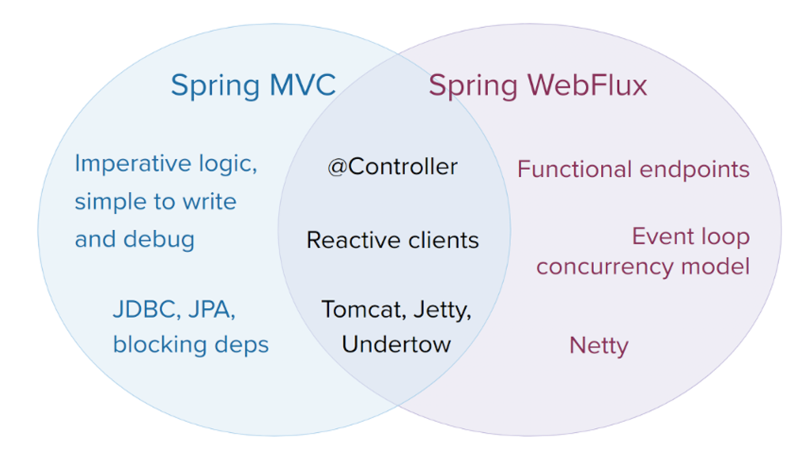

# 스프링 webFlux

## 프로젝트 리액터

- 프로젝트 리액터(Project Reactor) 는 리액티브 스트림의 구현체 중 하나로 스프링의 에코시스템 범주에 포함된 프레임워크이다
- 리액티브 스트림 사양을 구현하고 있으므로 리액티브 스트림에서 사용하는 용어와 규칙을 그대로 사용한다
- 리액터를 사용하면 애플리케이션에 리액티브 프로그래밍을 적용할 수 있고 비동기-논블로킹을 적용할 수 있다
- 함수형 프로그래밍의 접근 방식을 사용해서 비동기-논블로킹 코드의 난해함을 어느정도 해결한다
- 백프레셔(Backpressure) 를 사용해 시스템의 부하를 효율적으로 조절할 수 있다

# 

## Mono와 Flux

- 리액터는 리액티브 스트림의 Publisher 인터페이스를 구현하는 모노(Mono) 와 플럭스(Flux)라는 두 가지 핵심 타입을 제공한다
- Mono는 0..1개의 단일 요소 스트림을 통지하는 발행자이다
- Flux는 0..N개로 이뤄진 다수 요소 스트림을 통지하는 발행자이다
- 두 타입 모두 리액티브 스트림 데이터 처리 프로토콜대로 onComplete 또는 onError 시그널이 발생할 때 까지 onNext를 사용해 구독자에게 데이터를 통지한다.

### Mono.just를 사용한 Hello World 예제
- Mono.just(data: T) 는 객체를 인자로 받은 뒤 모노로 래핑하는 팩토리 함수이다.

```kotlin
package mono
import reactor.core.publisher.Mono

fun main() {
    val mono: Mono<String> = Mono.just("Hello Reactive World")
    mono.subscribe(::println)
}
```

> 출력결과 : Hello Reactive World

#### subscribe()를 호출하지 않은 경우

```kotlin
package mono
import reactor.core.publisher.Mono

fun main() {
    val mono: Mono<String> = Mono.just("Hello Reactive World")
    println(mono)
}
```

> 출력결과 : MonoJust

- 모노와 플럭스의 연산자는 모두 Lazy(게으르게) 동작하여 subscribe를 호출하지 않으면 리액 티브 스트림 사양대로 코드가 동작하지 않는다.
- 즉 subscribe는 Terminal Operator(최종 연산자) 이다.
- Java8의 스트림도 이와 유사하게 map , flatMap , filter 등은 중간 연산자이고 collect, findFirst , count 등이 최종 연산자이다.

### Flux 사용한 예제

- Flux는 Mono와 다르게 다수의 요소를 통지할 수 있다.

```kotlin
import reactor.core.publisher.Flux

data class Cellphone(
    val name: String,
    val price: Int,
    val currency: Currency,
)

enum class Currency {
    KRW, USD
}

fun main() {
    val iphone =
        Cellphone(name = "Iphone", price = 100, currency = Currency.KRW)
    
    val galaxy =
        Cellphone(name = "Galaxy", price = 90, currency = Currency.KRW)
    
    val flux: Flux<Cellphone> =
        Flux.just(iphone, galaxy)
    
    flux.subscribe(::println)
}
```

> 출력결과
> Cellphone(name=Iphone, price=100, currency=KRW)
> Cellphone(name=Galaxy, price=90, currency=KRW)

# 

## 스프링 WebFlux와 스프링 MVC 비교

### 스프링 MVC

- 스프링으로 개발된 대부분의 웹 애플리케이션은 서블릿 기반의 스프링 MVC이다
- 스프링 MVC는 동시성 처리를 전통적 웹 방식인 하나의 스레드가 하나의 요청을 처리하는 Thread per Request Model 사용한다
- Thread per Request Model은 DB, Network IO 등이 발생할 경우 결과를 받기까지 스레드가 블로킹됨
- 이러한 문제를 해결하기 위해 스레드 풀을 사용해 동시성을 제어한다

### 스프링 Webflux

- 스프링 WebFlux 는 전통적 웹 프레임워크인 스프링 MVC 와 대비되는 리액티브 기반의 웹 스택 프레임워크이다
- 기본적으로 프로젝트 리액터 기반이며 리액티브 스트림의 다른 구현체인 RxJava나 코틀린 코루틴으로도 개발이 가능하다
- 스프링 WebFlux는 비동기-논 블로킹로 동작하므로 적은 수의 스레드로도 대량의 동시성을 제어할 수 있다
- 스프링 MVC와 스프링 WebFlux의 공통점과 각각이 고유하게 지원하는 기능 들



### 스프링 MVC
- 명령형 코드 작성은 코드의 흐름을 쉽게 이해할 수 있고 디버깅하기 쉽다
- 대부분의 스프링 웹 애플리케이션이 스프링 MVC 기반이므로 안정성과 풍부한 라이브러리를 지원
- JPA, JDBC와 같은 블로킹 API를 사용하는 경우에는 스프링 MVC를 사용하는 것이 낫다

### 스프링 WebFlux
- 함수형 엔드포인트와 애노테이션 컨트롤러 방식을 모두 지원
- 이벤트 루프 동시성 모델
- 스프링 MVC에 비해 러닝커브가 많이 높은 편
- 전 구간 비동기-논블로킹인 경우에 최적의 성능을 보여준다

```
// 어쩔 수 없이 블로킹 API를 쓰는 경우 별도의 스케쥴러로 동작시키는 게 좋다
val blockingWrapper = Mono.fromCallable {
    // JPA의 블로킹 코드
    jpaRepository.findById(id)
}.subscribeOn(Schedulers.boundedElastic())
```

- 스프링 MVC에서도 리액터와 WebFlux 의존성을 추가하여 리액티브 코드와 논블로킹 라이브러리를 사용할 수 있다.

# 

## 스프링 WebFlux Hello World 애플리케이션

### 스프링 이니셜라이저

- Spring Reactive Web 의존성 추가

```kotlin
import org.jetbrains.kotlin.gradle.tasks.KotlinCompile

plugins {
    id("org.springframework.boot") version "2.7.1"
    id("io.spring.dependency-management") version "1.0.11.RELEASE"
    kotlin("jvm") version "1.6.21"
    kotlin("plugin.spring") version "1.6.21"
}

group = "com.fastcampus"
version = "0.0.1-SNAPSHOT"
java.sourceCompatibility = JavaVersion.VERSION_17

repositories {
    mavenCentral()
}

dependencies {
    // Spring Webflux Starter
    implementation("org.springframework.boot:spring-boot-starter-webflux")
    implementation("com.fasterxml.jackson.module:jackson-module-kotlin")
    implementation("io.projectreactor.kotlin:reactor-kotlin-extensions")
    implementation("org.jetbrains.kotlin:kotlin-reflect")
    implementation("org.jetbrains.kotlin:kotlin-stdlib-jdk8")
    implementation("org.jetbrains.kotlinx:kotlinx-coroutines-reactor")
    testImplementation("org.springframework.boot:spring-boot-starter-test")
    testImplementation("io.projectreactor:reactor-test")
}

tasks.withType<KotlinCompile> {
    kotlinOptions {
        freeCompilerArgs = listOf("-Xjsr305=strict")
        jvmTarget = "17"
    }
}

tasks.withType<Test> {
    useJUnitPlatform()
}
```

