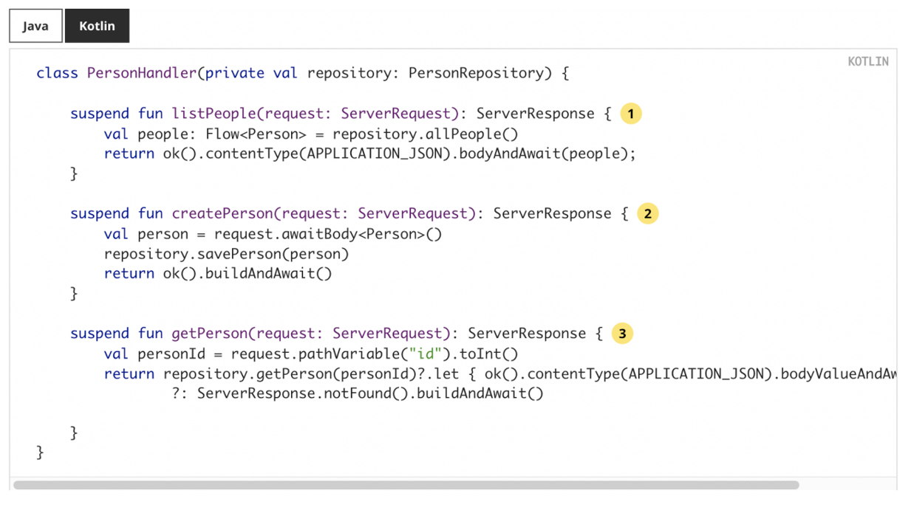

# webflux + coroutine 

## 스프링 WebFlux의 코루틴 지원

- 프로젝트 리액터 기반의 리액티브 프로그래밍은 비동기-논블로킹의 단점인 콜백 헬 문제를 순차적으로 동작하는 연산자를 통해 해결한다
- 기존에 함수형 패러다임에 익숙하거나 리액터의 다양한 연산자에 대한 학습이 부담 없다면 리액티브 프로그래밍은 비동기-논블로킹 코드 작성시 매우 좋은 솔루션이지만 막상 공부해 보면 러닝커브가 매우 높다
- 앞서 말한 어려움으로 인해 안드로이드도 최근엔 RxJava에서 코루틴 기반으로 작성하는 코드가 늘어나고 있고 서버 측에서도 코루틴을 도입하는 사례가 많아지고 있다

<br/>

## 코루틴

- 코루틴(Coroutine) 은 코틀린에서 비동기-논블로킹 프로그래밍을 명령형 스타일로 작성할 수 있도록 도와주는 라이브러리이다
- 코루틴은 멀티 플랫폼을 지원하여 코틀린을 사용하는 안드로이드, 서버 등 여러 환경에서 사용할 수 있다
- 코루틴은 일시 중단 가능한 함수(suspend function) 를 통해 스레드가 실행을 잠시 중단했다가 중단한 지점부터 다시 재개(resume) 할 수 있다

```
suspend fun combineApi() = coroutineScope {
    val response1 = async { getApi1() }
    val response2 = async { getApi2() }
    
    return ApiResult (
        response1.await()
        response2.await()
    )
}
```


## 스프링 WebFlux의 코루틴 지원

- 스프링 WebFlux 공식문서의 코틀린 예제들을 보면 모두 코루틴 기반의 예제를 소개하고 있다



- 스프링 MVC, 스프링 WebFlux 모두 코루틴을 지원하여 의존성만 추가하면 바로 사용 가능
- 아래 의존성을 build.gradle.kts에 추가하면 코루틴을 사용할 수 있다

```kotlin
dependencies {
    implementation("org.jetbrains.kotlinx:kotlinx-coroutines-core:${version}")
    implementation("org.jetbrains.kotlinx:kotlinx-coroutines-reactor:${version}")
}
```

### 리액티브가 코루틴으로 변환되는 방식

- Mono는 suspend 함수로 변환
- Flux는 Flow로 변환

```
//Mono → suspend
fun handler(): Mono<Void> -> suspend fun handler()

//Flux → Flow
fun handler(): Flux<T> -> fun handler(): Flow<T>
```

### 코루틴을 적용한 컨트롤러 코드

```kotlin
@RestController
class UserController(
    private val userService : UserService,
    private val userDetailService: UserDetailService
) {
    @GetMapping("/{id}")
    suspend fun get(@PathVariable id: Long) : User {
        return userService.getById(id)
    }
    
    @GetMapping("/users")
    suspend fun gets() = withContext(Dispatchers.IO) {
        val usersDeffered = async { userService.gets() }
        val userDetailsDeffered = async { userDetailService.gets() }
        
        return UserList(usersDeffered.await(), userDetailsDeffered.await())
    }
}
```

### 코루틴을 사용한 WebClient

- 기존 리액티브 코드를 코루틴으로 변환하고 싶다면 awaitXXX 시작하는 확장 함수를 사용하면 즉시 코루틴으로 변환할 수 있다

```kotlin
val client = WebClient.create("https://example.org")

val result = client.get()
    .uri("/persons/{id}", id)
    .retrieve()
    .awaitBody<Person>()
```

### Spring Data R2DBC의 ReactiveCrudRepository에서 코루틴 적용

```kotlin
interface ContentReactiveRepository : ReactiveCrudRepository<Content, Long> {
    fun findByUserId(userId: Long) : Mono<Content>
    fun findAllByUserId(userId: Long): Flux<Content>
}

class ContentService (
    val repository : ContentReactiveRepository
) {
    fun findByUserIdMono(userId: Long) : Mono<Content> {
        return repository.findByUserId(userId)
    }

    suspend fun findByUserId (userId: Long) : Content {
        return repository.findByUserId(userId).awaitSingle()
    }
}
```

### CoroutineCrudRepository 를 사용하면 awaitXXX 코드 없이 사용 가능

```kotlin
interface ContentCouroutineRepository : CoroutineCrudRepository<Content, Long> {
    suspend fun findByUserId(userId:Long) : Content?
    fun findAllByUserId(userId: Long): Flow<Content>
}

class ContentService (
    val repository : ContentCouroutineRepository
) {
    suspend fun findByUserId (userId: Long) : Content {
        return repository.findByUserId(userId)
    }
}
```

