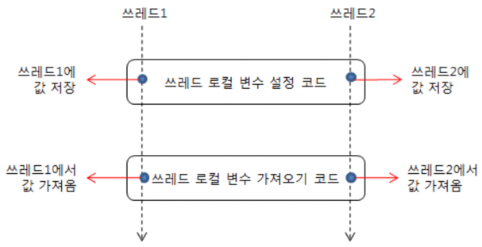

# ThreadLocal

## ThreadLocal

- ThreadLocal 클래스에는 get, set 메서드가 있는데 이를 호출하는 스레드마다 다른 값을 사용할 수 있도록 관리해준다.
  - ThreadLocal 클래스의 get 메서드를 호출하면 현재 실행중인 스레드에서 최근에 set 메서드를 호출해 저장했던 값을 가져올 수 있다.
- 사용하는 경우
  - 스레드 로컬 변수는 변경 가능한 싱글턴이나 전역 변수 등을 기반으로 설계되어있는 구조에서 변수가 임의로 공유되는 상황을 막기위해

> [예시]
  -  JDBC 연결시, 멀티스레드 어플리케이션에서 적절한 동기화 없이 연결 객체를 전역변수로 만들어 사용하면 스레드 안전하지 않다.
     이때 ConnectionHolder와 같이 JDBC 연결을 보관할떄 ThreadLocal을 사용하면 스레드는 저마다 각자의 연결 객체를 갖게된다.
  - 

> [스레드 안정성 보장]
  - 단일 스레드에서 동작하던 기능을 멀티스레드 환경으로 구성해야할때, 그 의미에 따라 다르지만 공유된 전역 변수를 ThreadLocal을 활용하도록 변경하면 스레드 안정성을 보장할 수 있다.

> [주의할점]
  - 현재 진행중인 트랜잭션이 어느것인지 확인하고 싶을때 트랜잭션이 보관되어있는 ThreadLocal 클래스에서 쉽게 찾아낼 수 있다.
    이런식으로 전역변수가 아니면서도 전역변수로 동작하기 때문에 조심해야할 필요는 있다. 
  - ThreadLocal를 사용할때 재사용성을 크게 떨어뜨릴 수 있고, 객체간에 눈에 보이지 않는 연결 관계를 만들어내기 쉽기 떄문에
    정확하게 영향도를 파악하여 사용해야한다.

```java
@Slf4j
public class ThreadLocalService {
    private ThreadLocal<String> nameStore = new ThreadLocal<>();

    public String logic(String name) {
        log.info("저장 name={} -> nameStore={}", name, nameStore.get());
        nameStore.set(name);
        sleep(1000);
        log.info("조회 nameStore={}", nameStore.get());
        return nameStore.get();
    }

    private void sleep(int millis) {
        try {
            Thread.sleep(millis);
        } catch (InterruptedException e) {
            e.printStackTrace();
        }
    }
}
```

> 테스트 코드
```java
@Slf4j
public class FieldServiceTest {
	private FieldService fieldService = new FieldService();
    
	@Test
	void field() {
		log.info("main start");
		Runnable userA = () -> {
			fieldService.logic("userA");
		};
		Runnable userB = () -> {
			fieldService.logic("userB");
		};
        
		Thread threadA = new Thread(userA);
		threadA.setName("thread-A");
		Thread threadB = new Thread(userB);
		threadB.setName("thread-B");
		threadA.start(); //A실행
        
		sleep(2000); //동시성 문제 발생X
		// sleep(100); //동시성 문제 발생O
        
		threadB.start(); //B실행
		sleep(3000); //쓰레드B가 끝날 때까지 메인 쓰레드 종료 대기
		log.info("main exit");
	}
    
	private void sleep(int millis) {
		try {
			Thread.sleep(millis);
		} catch (InterruptedException e) {
			e.printStackTrace();
		}
	}
}
```

<br/>

## ThreadLocal 사용법

- ThreadLocal<T> 클래스는 Map<Thread, T>라는 자료구조로 구성되어있고, Map<Thread, T>를 사용하여 스레드별 값을 보관한다.
- Map<Thread, T> 를 사용해 구현되어있다는 말은 아니다. 스레드별 값은 실제로 Thread 객체 자체에 저장되어있다.
- 스레드가 종료되면 스레드별 값으로 할당되어 있던 부분도 가비지 컬렉터가 처리한다.

> [사용]
- 값 저장: ThreadLocal.set(value)
- 값 조회: ThreadLocal.get()
- 값 제거: ThreadLocal.remove()

> [주의할점]
- 쓰레드 로컬의 값을 사용 후 제거하지 않고 그냥 두면 메모리 누수가 발생할 수 있다.
- 또한 WAS(톰캣)처럼 쓰레드 풀을 사용하는 경우에는 해당 쓰레드를 제거하지 않고 나중에 재사용하게 된다.
  - 이때, ThreadLoal에 값도 그 전 값이 그대로 저장되어있다. 따라서 다른 데이터가 반환되는 심각한 문제가 발생한다.
- 반드시 ThreadLocal 사용 후에는 .remove()를 호출해줘야한다.

<br/>

#### [My dev blog]
- https://devfunny.tistory.com/842
