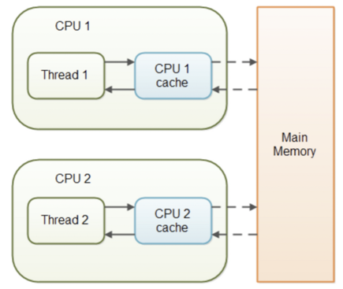
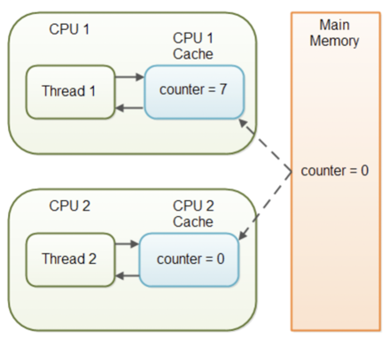
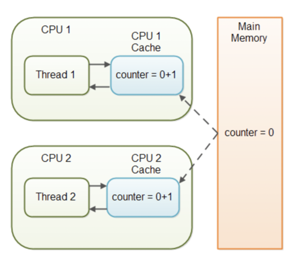

# volatile

## volatile 키워드
- 멀티 쓰레드 어플리케이션에서 각 쓰레드는 성능상의 이유로 메인 메모리에서 CPU 캐시로 변수를 복사할 수 있다.
- 쓰레드는 변수를 읽을때도 메인 메모리까지 접근하지 않고 CPU 캐시에서 읽을 수 있다.
  - 변수에 값을 쓰는 경우 : Thread -> CPU 캐시 -> Main Memory
  - 변수의 값을 읽는 경우 : Main Memory -> CPU 캐시 -> Thread



- Java Virtual Machine(JVM)은 메인 메모리에서 CPU 캐시로 데이터를 읽어들이거나 CPU 캐시에서 메인 메모리로 데이터를 쓰는 시기를 보장하지 않는다.
```java
public class Test {
    public int counter = 0;
}
```
- counter 변수가 volatile로 선언되지 않은 경우 counter 변수의 값이 CPU 캐시에서 메인 메모리로 다시 기록되는 시점에 대한 보장은 없다. 즉, CPU 캐시의 카운터 변수 값이 메인 메모리와 동일하지 않을 수 있다.



- 쓰레드1이 counter 변수를 0에서 7로 변경했다. (CPU 캐시에만 변경된 값이 쓰이고 메인 메모리에는 기록되지 않은 시점)
- 메인 메모리에는 아직 최신 값이 반영되지 않았기 때문에 쓰레드2는 이전 값인 0을 읽어들인다.
- 쓰레드가 변경한 값이 아직 메인 메모리에 기록되지 않았기 때문에 다른 쓰레드가 변수의 최신 값을 볼 수 없는 문제를 "가시성" 문제라고 한다. 
  - 한 쓰레드의 업데이트는 다른 쓰레드에 표시되지 않는 문제다.

<br/>

## Java volatile의 가시성 보장

- 변수의 가시성 문제를 해결하기 위해 Java의 volatile 키워드가 나왔다. 
- counter 변수를 volatile로 선언하면 counter 변수에 값을 쓸 때 즉각 메인 메모리에 기록된다. 
- 또한 counter 변수를 읽을 때 항상 즉시 메인 메모리로부터 읽혀진다.

```java
public class Test {
    public volatile int counter = 0;
}
```

<br/>

## volatile 사용 예제

> VolatileCachedFactorizer
```java
package com.concurrency.chapter03.예제3_12_불변객체_volatile키워드;

import java.math.BigInteger;
import javax.servlet.*;

import net.jcip.annotations.*;

@ThreadSafe
public class VolatileCachedFactorizer extends GenericServlet implements Servlet {
    /*
        OneValueCache 클래스를 사용하여 입력값과 결과를 캐시한다.
        volatile 키워드 선언하여 cache 변수를 선언했다.
        새로 생성한 OneValueCache 인스턴스를 설정하면 다른 스레드에서도 cache 변수에 설정된 새로운 값을 즉시 사용할 수 있다.
    */
    private volatile OneValueCache cache = new OneValueCache(null, null);

    public void service(ServletRequest req, ServletResponse resp) {
        BigInteger i = extractFromRequest(req);
        BigInteger[] factors = cache.getFactors(i);

        if (factors == null) {
            factors = factor(i);
            // 새로운 객체 생성 (불변객체)
            cache = new OneValueCache(i, factors);
        }

        encodeIntoResponse(resp, factors);
    }

    void encodeIntoResponse(ServletResponse resp, BigInteger[] factors) {
    }

    BigInteger extractFromRequest(ServletRequest req) {
        return new BigInteger("7");
    }

    BigInteger[] factor(BigInteger i) {
        // Doesn't really factor
        return new BigInteger[]{i};
    }
}
```

> OneValueCache.java
```java
package com.concurrency.chapter03.예제3_12_불변객체_volatile키워드;

import java.math.BigInteger;
import java.util.*;

import net.jcip.annotations.*;

@Immutable
public class OneValueCache {
    /* 불변 */
    private final BigInteger lastNumber;
    private final BigInteger[] lastFactors;

    public OneValueCache(BigInteger i, BigInteger[] factors) {
        lastNumber = i;
        lastFactors = Arrays.copyOf(factors, factors.length);
    }

    public BigInteger[] getFactors(BigInteger i) {
        if (lastNumber == null || !lastNumber.equals(i))
            return null;
        else
            // 새로운 불변 객체 생성
            return Arrays.copyOf(lastFactors, lastFactors.length);
    }
}
```

<br/>

## 한계 

- volatile 키워드가 volatile 변수의 모든 읽기를 메인 메모리에서 직접 읽어들이고 volatile 변수에 대한 모든 쓰기가 직접 메인 메모리에 기록된다고 해도 여전히 충분하지 않은 상황이 존재한다.
- 쓰레드1만 공유 변수에 쓰는 상황에서 해당 변수를 volatile로 선언하면 쓰레드2가 항상 최신 값을 볼 수 있다.
  - 즉, 하나의 쓰레드만 쓰는 역할을 한다면 멀티 쓰레드간의 가시성이 보장된다.



- 쓰레드1과 쓰레드2는 이제 실질적으로 동기화에서 멀어졌다. 
- 공유 counter 변수의 실제 값은 2여야 하지만 각 쓰레드는 CPU 캐시에 있는 변수의 값을 메인 메모리에 옮기더라도 1이 될 것이다.

<br/>

## 결론

- 한 쓰레드만 volatile 변수 값을 쓰고, 다른 쓰레드는 읽기만 하는 경우라면 volatile 변수에 기록된 최신 값이 항상 보장된다. 
- 하지만 둘 다 읽기/쓰기를 모두 한다면 더 이상 동기화가 보장된다고 확신할 수는 없다.

<br/>

## 성능 고려사항

- volatile 변수에 대한 읽기와 쓰기는 변수를 메인 메모리로 부터 읽거나 쓴다. 하지만 메인 메모리에 읽고 쓰는것은 CPU 캐시보다 더 cost가 비싸다고 할 수 있다.
- volatile 변수는 성능을 개선 기법인 명령(instruction)들의 재배치를 방지하기 때문에 변수의 가시성을 강제할 필요가 있는 경우에만 volatile 변수를 사용하는 것이 좋다.

<br/>

#### [My dev blog]
- https://devfunny.tistory.com/841

##### References
- https://programmer-chocho.tistory.com/82

