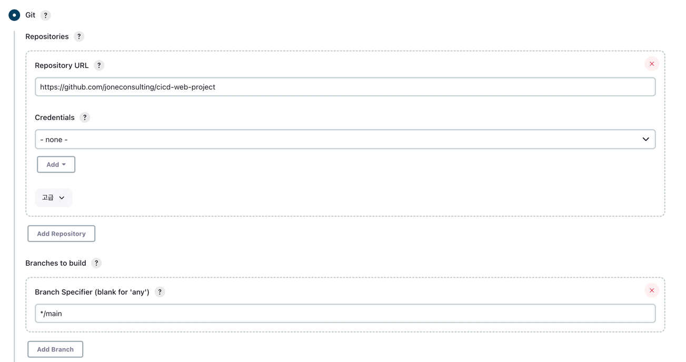
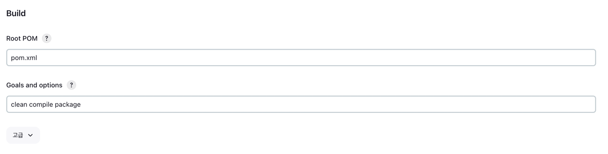
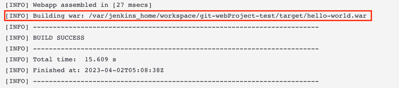
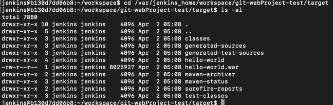

## docker Jenkins 에 maven Web 프로젝트 빌드해보기

### 1) Dashboard -> Jenkins 관리 -> Plugins 
- maven 검색 -> Maven Integration 설치

### 2) Dashboard -> 새로운 Item
- Maven Project 선택
- git 정보 입력

- maven 정보 입력

### 3) 빌드 수행

docker container 접속해서 아래 명령어 입력시 hello-world.war 보임

