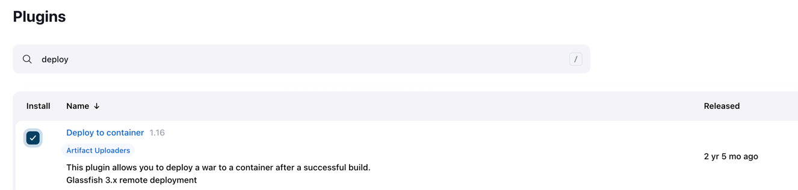
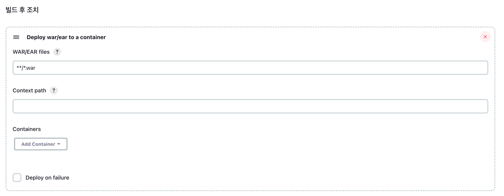
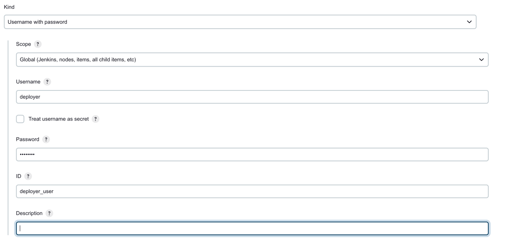
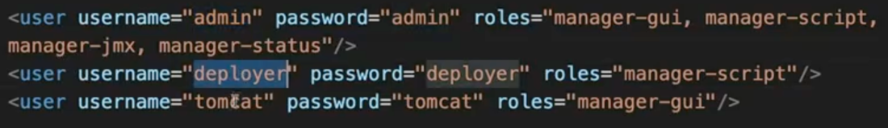

## docker Jenkins 에 tomcat 설치

### 1) Dashboard -> Jenkins 관리 -> Plugins
- deploy 검색 -> Deploy to container 설치

- 이 플러그인이 있어야 jenkins에서 패키징한 war 파일을 톰캣 웹어플리케이션 서버에 복사하여 넣을 수 있다.

### 2) Dashboard -> 새로운 Item
- Maven Project 선택
- git 정보 입력
  

- maven 정보 입력
  

- 빌드 후 조치 정보 입력 
> Deploy war/ear to a container (컨테이너에 배포)
> **/*.war (압축한 파일(패키징) 위치)

 
- 빌드 후 조치 정보 > Container 정보 입력
- Credentials Add 후 선택 

- 위 정보는 Tomcat 계정 추가 필요
  - tomcat-users.xml 에 계정 추가
    
- Tomcat URL : http://본인IP:8088/ (localhost로 하면 젠킨스 내 서버로 인식된다.)

### 3) 빌드 수행
- Building war 경로의 .war 파일이 만들어졌고,
- Deploying 경로로 복사
- 톰캣 경로로 이동
`tomcat home 폴더/webapps/hello-world.war`