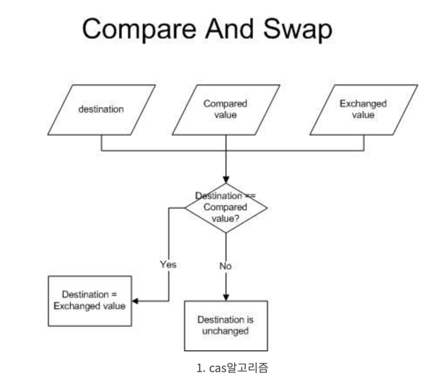
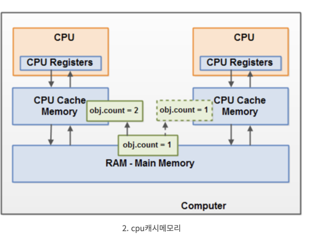

# AtomicLong

## AutomicLong
- Long 자료형을 갖고있는 Wrapping 클래스이다.
- blocking이 아닌 non-blocking하면서 원자성을 보장하여 동기화 문제를 해결한다.
- 핵심 동작 원리는 CAS 알고리즘이다.

### CAS 알고리즘 (Compared and Swap)

- CAS 알고리즘



- CPU 캐시 메모리



###### 출처 : https://beomseok95.tistory.com/225

### 동작원리
- 인자로 기존 값(Compared Value)과 변경할 값(Exchanged Value)을 전달한다.
- 기존 값(Compared Value)이 현재 메모리가 가지고 있는 값(Destination)과 같다면 변경할 값(Exchanged Value)을 반영하며 true를 반환한다.
- 반대로 기존 값(Compared Value)이 현재 메모리가 가지고 있는 값(Destination)과 다르다면 값을 반영하지 않고 false를 반환한다.

### 기존 값으로 던진 값이 현재 메모리가 가지고 있는 값과 다른 경우
- 스레드 A가 공유 변수에 대해 계산을 하고, 메모리에 반영하기 직전에 다른 스레드 B가 공유 변수를 변경하여 메모리에 반영한 경우를 의미한다.

```java
public class AtomicInteger extends Number implements java.io.Serializable {
    private static final Unsafe U = Unsafe.getUnsafe();
    private static final long VALUE = U.objectFieldOffset(AtomicInteger.class, "value");
    
    private volatile int value;
    
    public final int incrementAndGet() {
            return U.getAndAddInt(this, VALUE, 1) + 1;
    }
}

public final class Unsafe {
    @HotSpotIntrinsicCandidate
    public final int getAndAddInt(Object o, long offset, int delta) {
            int v;
            do {
                    v = getIntVolatile(o, offset);
            } while (!weakCompareAndSetInt(o, offset, v, v + delta));
                    return v;
    }
}
```

- 위 코드에서 value 변수에 volatile 키워드가 붙어있다.
```
private volatile int value;
```

- volatile은 원자성 문제는 해결해주지않고, 가시성 문제만 해결해주므로 해당 공유 변수에 동시 쓰기가 발생하면 동기화 문제가 발생할 수 있다.
  - 가시성 문제 : 하나의 스레드에서 공유자원을 수정한 결과가 다른 스레드에게 보이지 않은 경우 발생하는 문제
  - 원자성 문제 : 공유되는 변수를 변경할 때, 기존의 값을 기반으로 하여 새로운 값이 결정되는 과정에서 여러 Thread가 이를 동시에 수행할 때 생기는 이슈

> 예제 
```java
package com.concurrency.chapter02.예제2_4_AtomicLong_사용;

import java.math.BigInteger;
import java.util.concurrent.atomic.*;
import javax.servlet.*;

import net.jcip.annotations.*;

@ThreadSafe
public class CountingFactorizer extends GenericServlet implements Servlet {
    private final AtomicLong count = new AtomicLong(0);

    public long getCount() { return count.get(); }

    public void service(ServletRequest req, ServletResponse resp) {
        BigInteger i = extractFromRequest(req);
        BigInteger[] factors = factor(i);

        /* 카운터 증가시킴. 증가된 결과 값을 리턴함 */
        count.incrementAndGet();
        encodeIntoResponse(resp, factors);
    }

    void encodeIntoResponse(ServletResponse res, BigInteger[] factors) {}
    BigInteger extractFromRequest(ServletRequest req) {return null; }
    BigInteger[] factor(BigInteger i) { return null; }
}
```

- AtomicLong 타입의 count
  - count 에 접근하는 모든 동작이 단일 연산으로 처리된다.
  - 서블릿 상태가 카운터의 상태이고 카운터가 스레드에 안전하기 때문에 서블릿도 스레드에 안전하다.

<br/>

## AtomicReference 객체가 2개라면 스레드 안정하지 않다

- 변수 2개는 각각은 스레드에 안전하지만 클래스 자체는 틀린 결과를 낼 수 있다.

```java
package com.concurrency.chapter02.예제2_5_AtomicReference객체_2개;

import java.math.BigInteger;
import java.util.concurrent.atomic.*;
import javax.servlet.*;

import net.jcip.annotations.*;

/**
 * 이런 코드는 금물!
 * 단일 연산을 적절히 사용하지 못한 상태에서 결과 값을 캐시하려는 서블릿
 */
@NotThreadSafe
public class UnsafeCachingFactorizer extends GenericServlet implements Servlet {
    // 가장 마지막으로 인수분해하기 위해 입력된 숫자
    private final AtomicReference<BigInteger> lastNumber = new AtomicReference<BigInteger>();
    // 위 입력 값을 인수분해한 결과값
    private final AtomicReference<BigInteger[]> lastFactors = new AtomicReference<BigInteger[]>();

    public void service(ServletRequest req, ServletResponse resp) {
        BigInteger i = extractFromRequest(req);

        if (i.equals(lastNumber.get()))
            encodeIntoResponse(resp, lastFactors.get());
        else {
            BigInteger[] factors = factor(i);
            
            lastNumber.set(i);
            lastFactors.set(factors);

            encodeIntoResponse(resp, factors);
        }
    }

    void encodeIntoResponse(ServletResponse resp, BigInteger[] factors) {
    }

    BigInteger extractFromRequest(ServletRequest req) {
        return new BigInteger("7");
    }

    BigInteger[] factor(BigInteger i) {
        // Doesn't really factor
        return new BigInteger[]{i};
    }
}
```

### 여러개의 변수가 하나의 불변조건을 구성하는 경우 
- 불변조건 : 인수분해 결과를 곱한 값이 lastNumber에 캐시된 값과 같아야한다.
- 여러개의 변수가 하나의 불변조건을 구성하고 있다면, 이 변수들은 서로 독립적이지 않다.

```
if (i.equals(lastNumber.get()))
```

- 즉, 한 변수의 값이 다른 변수에 들어갈 수 있는 값을 제한할 수 있다.
- 따라서 변수 하나를 갱신할땐 다른 변수도 동일한 단일 연산 작업 내에서 함께 변경해야한다.

### 단일 연산으로 동작하지 않는 경우
- 개별적인 각 set 메소드는 단일 연산으로 동작한다.
- 단일 연산 참조 클래스를 쓰더라도 lastNumber, lastFactors라는 두개의 값을 동시에 갱신하지는 못한다.

```
lastNumber.set(i);
lastFactors.set(factors);
```

- 하나는 수정됐고, 하나는 수정되지 않은 그 시점에 여전이 취약점이 존재한다. 이 순간 다른 스레드가 값을 읽어갈 수 있다.
- 상태를 일관성있게 유지하려면, 관련 있는 변수들을 하나의 단일 연산으로 갱신해야한다.
  - synchronized 구문을 사용해야한다.

<br/>

## 숫자 범위를 나타내는 클래스, 의존성 조건으로, 스레드 안정성을 확보하지 못했다.

```java
public class NumberRange {
    /* 조건 : 첫번째 숫자가 두번째 숫자보다 작거나 같아야한다. */
    // -> 의존성 조건 : lower <= upper
    private final AtomicInteger lower = new AtomicInteger(0);
    private final AtomicInteger upper = new AtomicInteger(0);

    public void setLower(int i) {
        // 주의 - 안전하지 않은 비교문
        if (i > upper.get())
            throw new IllegalArgumentException("can't set lower to " + i + " > upper");
        lower.set(i);
    }

    public void setUpper(int i) {
        // 주의 - 안전하지 않은 비교문
        if (i < lower.get())
            throw new IllegalArgumentException("can't set upper to " + i + " < lower");

        upper.set(i);
    }

    public boolean isInRange(int i) {
        return (i >= lower.get() && i <= upper.get());
    }
}
```

- NumberRange 클래스는 스레드 안정성을 확보하지 못했다.
> lower, upper라는 변수의 의존성 조건을 100% 만족시키지 못한다.
> 메서드에서 각 확인중인 조건 체크는 제대로 동작하지 않을 수도 있다.
> -> setLower, setUpper 메서드 양쪽 모두 비교문을 사용하지만, 비교문을 단일 연산으로 처리할 수 있도록 동기화 기법을 적용하지 않고있다.
> 만약, 숫자 범위가 (0, 10)인 상태에서 스레드 A가 setLower(5)를 호출했다고 하자.
> 그와 동시에 스레드 B가 setUpper(4)를 호출했다고 하자.
> 양쪽 모두 스레드 비교문을 통과해서 작은 숫자로 5, 큰 숫자를 4로 지정하는 상태에 이를 수 있다.
> 결과적으로 (5, 4)라는 숫자 범위는 의존성 조건에 위배된다.

- NumberRange 클래스는 upper와 lower 변수 주변에 락을 사용하는 등의 방법을 적용하여 동기화하면 쉽게 의존성 조건을 충족시킬 수 있다.
- 그리고 lower, upper 변수를 외부에 공개해 다른 프로그램에서 의존성 조건을 무시하고 값을 변경하는 사태가 일어나지 않도록 적절하게 캡슐화해야한다.
- 이 클래스처럼 두개 이상의 변수를 사용하는 복합 연산 메서드를 갖고 있다면 위임 기법만으로는 스레드 안정성을 확보할 수 없다.
- 이런 경우에는 내부적으로 락을 활용해서 복합 연산이 단일 연산으로 처리되도록 동기화해야한다.