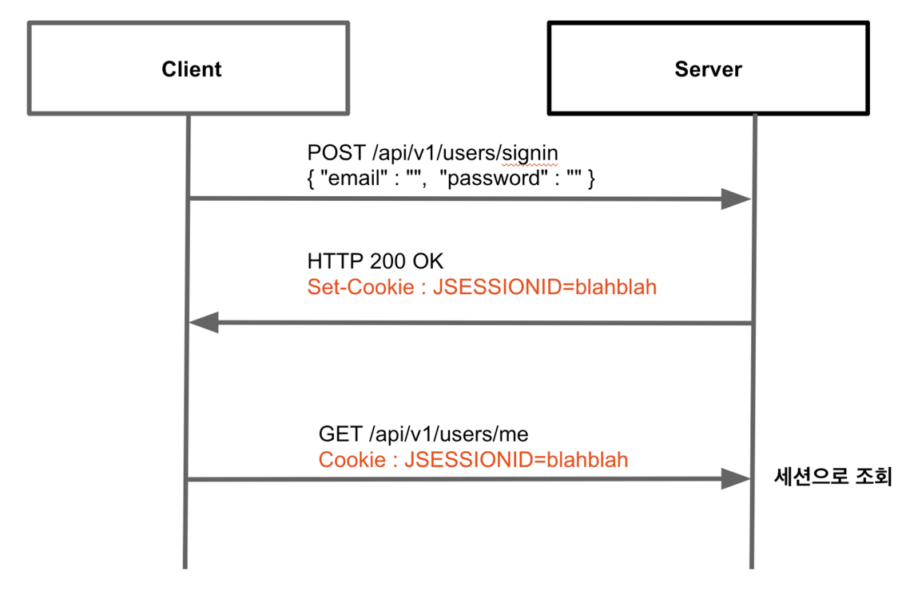
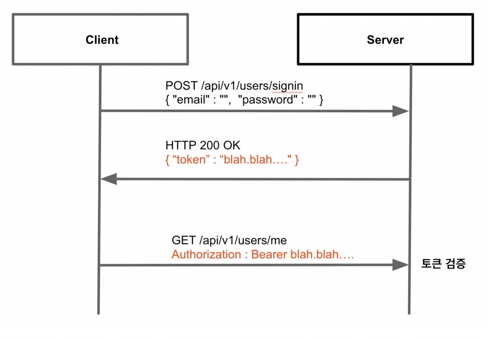

# Spring JWT Token 미니 프로젝트

## 인증 방법

- 사용자의 로그인 상태를 처리하는 방법은 대표적으로 `세션 기반 인증` 방식과 `토큰 기반 인증` 방식으로 나뉜다.

<br/>

## 세션 기반 인증

- 세션 기반 인증 방식은 서버가 클라이언트의 세션 정보를 저장하고 있는 stateful 방식이다


### 특징
- 사용자가 로그인을 하게되면 서버는 사용자 정보 검증 후 세션 id를 발급하고 브라우저의 쿠키에 저장한다
- 브라우저는 모든 요청마다 쿠키에 있는 세션 id를 포함하고 서버는 세션 id를 통해 유저 정보를 세션 스토리지에서 조회한다
- 일반적으로 서버 메모리, 데이터베이스 등을 사용해 세션을 저장한다
- 세션은 서버에서 만료(invalidate) 시켜서 클라이언트의 권한을 회수할 수 있다

### 단점
- 서버 확장이 어렵다. 분산 환경에선 환경에서는 세션을 공유할 수 있는 세션 클러스터링이 필요하다
- 중앙에서 세션을 관리할 수 있는 세션 데이터베이스를 구축해야한다
- 요청이 많아지면 세션 조회에 따른 데이터베이스 부하가 심해질 수 있다

<br/>

## 토큰 기반 인증

- 토큰 기반 인증 방식은 서버가 클라이언트의 세션을 저장하지 않기 때문에 stateless 방식이다
- 대표적으로 JWT(JSON Web Token) 이 있다


### 특징
- 사용자가 로그인을 하게되면 서버는 사용자 정보 검증 후 토큰을 발급하고 응답으로 내려준다
- 클라이언트는 토큰을 저장하고 있다가 Authorization 헤더에 토큰을 전달한다
- 서버가 분산된 환경에서도 서버에선 클러스터링 처리가 필요 없다는 것이 장점이다
- JWT 토큰 내부에는 기본적인 정보와 검증된 토큰임을 증명하는 서명과 같은 유용한 정보를 가지고 있다
- 토큰안에 유용한 정보를 담고 있어서 I/O 작업을 하지 않아도 된다

### 단점
- 한번 발행된 토큰은 클라이언트가 보관하고 있으므로 회수하기 어렵다
- 회수가 어렵고 탈취되면 대처가 어려우므로 만료 시간을 짧게 가져가야한다
- 토큰이 길어지면 네트워크 부하가 커질 수 있다
- 페이로드는 암호화된 정보가 아니기 때문에 민감정보를 담아선 안된다
- JWT의 경우 단일 키를 사용하기 때문에 시크릿 키가 유출되면 보안 취약사항이된다

<br/>

## JWT 토큰 구조 

- JWT 토큰은 세가지 구성요소로 이뤄져 있다
  - 헤더(Header) : 토큰 타입과 서명 알고리즘을 정의한다
  - 페이로드(Payload) : 토큰 발급자, 토큰 유효기간, 유저 정보 등을 정의한다
  - 서명(Signature) : 메시지가 전송 과정에서 바뀌지 않은 것을 확인하는 보안서명
- 세가지 구성요소는 . 으로 구분한다
```
eyJhbGciOiJIUzI1NiIsInR5cCI6IkpXVCJ9
.eyJzdWIiOiIxMjM0NTY3ODkwIiwibmFtZSI6IkpvaG4gRG9lIiwiaWF0IjoxNTE2MjM5MDIyLCJ1c2VyIjp7ImlkIjoxMjM0LCJuYW1lIjoi7J207IOB7ZuIIn19
.NR1muetINl4FkGOaVWx2W3TYpcmo9tzXrwsrTIMuJRc
```
- jwt : https://jwt.io/

<br/>

## JWT 기반 인증 구현
- github 프로젝트 전체보기 : https://github.com/seohaem/2023/tree/main/fastcampus_kotlin/springboot

> build.gradle.kts
- 의존성을 추가한다.

```
dependencies {
  // ...
  // JWT 인증
  implementation("com.auth0:java-jwt:3.19.2")
  implementation("at.favre.lib:bcrypt:0.9.0")
  // ...
}
```

> appliciation.yml
- jwt 속성을 설정한다.

```
# jwt
jwt:
  issuer: jara
  subject: auth
  expires-time: 3600 # 1시간
  secret: my-secret
```

> utils/JWTUtils.kt
- carete() : jwt 생성 
- decode() : jwt 토큰 정보 꺼내기

```kotlin
package com.fastcampus.userservice.utils

import com.auth0.jwt.JWT
import com.auth0.jwt.algorithms.Algorithm.HMAC256
import com.auth0.jwt.interfaces.DecodedJWT
import com.fastcampus.kopring.userservice.config.JWTProperties
import java.util.*

// JWT 인증
object JWTUtils {
    fun createToken(claim: JWTClaim, properties: JWTProperties) =
        JWT.create()
            .withIssuer(properties.issuer)
            .withSubject(properties.subject)
            .withIssuedAt(Date())
            .withExpiresAt(Date(Date().time + properties.expiresTime * 1000))
            .withClaim("userId", claim.userId)
            .withClaim("profileUrl", claim.profileUrl)
            .withClaim("username", claim.username)
            .withClaim("email", claim.email)
            .sign(HMAC256(properties.secret))
            
    fun decode(token: String, secret: String, issuer: String): DecodedJWT {
        val algorithm = HMAC256(secret)
        val verifier = JWT.require(algorithm)
            .withIssuer(issuer)
            .build()
        return verifier.verify(token)
    }
}

data class JWTClaim(
    val userId: Long,
    val email: String,
    val profileUrl: String?,
    val username: String,
)
```

> JWTUtilsTest.kt
- JWTUtils.kt 를 테스트 해보자. 

```kotlin
package com.fastcampus.userservice.utils

import com.fastcampus.kopring.userservice.config.JWTProperties
import mu.KotlinLogging
import org.junit.jupiter.api.Assertions.assertEquals
import org.junit.jupiter.api.Assertions.assertNotNull
import org.junit.jupiter.api.Test

class JWTUtilsTest {
    private val logger = KotlinLogging.logger {}
    
    @Test
    fun createTokenTest() {
        val jwtClaim = JWTClaim(
            userId = 1,
            email = "dev@gamil.com",
            profileUrl = "profile.jpg",
            username = "개발자"
        )
      
        val properties = JWTProperties(
            issuer = "jara",
            subject = "auth",
            expiresTime = 3600,
            secret = "my-secret",
        )
      
        val token = JWTUtils.createToken(jwtClaim, properties)
      
        assertNotNull(token)
        logger.info { "token : $token" }
    }
    
    @Test
    fun decodeTest() {
        val jwtClaim = JWTClaim(
            userId = 1,
            email = "dev@gamil.com",
            profileUrl = "profile.jpg",
            username = "개발자"
        )
      
        val properties = JWTProperties(
            issuer = "jara",
            subject = "auth",
            expiresTime = 3600,
            secret = "my-secret",
        )
      
        val token = JWTUtils.createToken(jwtClaim, properties)
        val decode = JWTUtils.decode(token, secret = properties.secret, issuer = properties.issuer)
      
        with(decode) {
            logger.info { "claims : $claims" }
            val userId = claims["userId"]!!.asLong()
            assertEquals(userId, jwtClaim.userId)
            val profileUrl = claims["profileUrl"]?.asString()
            assertEquals(profileUrl, jwtClaim.profileUrl)
            val username = claims["username"]!!.asString()
            assertEquals(username, jwtClaim.username)
            val email = claims["email"]!!.asString()
            assertEquals(email, jwtClaim.email)
        }
    }
}
```

> AuthToken.kt
- 커스텀 어노테이션을 만들자.

```kotlin
package com.fastcampus.userservice.model

@Target(AnnotationTarget.VALUE_PARAMETER)
@Retention(AnnotationRetention.RUNTIME)
@MustBeDocumented

annotation class AuthToken
```

> WebConfig.java
-  AuthTokenResolver 클래스를 선언하자.

```kotlin
package com.fastcampus.userservice.config

import com.fastcampus.userservice.model.AuthToken
import org.springframework.context.annotation.Configuration
import org.springframework.core.MethodParameter
import org.springframework.stereotype.Component
import org.springframework.web.reactive.BindingContext
import org.springframework.web.reactive.config.CorsRegistry
import org.springframework.web.reactive.config.WebFluxConfigurer
import org.springframework.web.reactive.result.method.HandlerMethodArgumentResolver
import org.springframework.web.reactive.result.method.annotation.ArgumentResolverConfigurer
import org.springframework.web.server.ServerWebExchange
import reactor.core.publisher.Mono
import reactor.kotlin.core.publisher.toMono

@Configuration
class WebConfig(
    private val authTokenResolver: AuthTokenResolver,
) : WebFluxConfigurer {

    override fun configureArgumentResolvers(configurer: ArgumentResolverConfigurer) {
        super.configureArgumentResolvers(configurer)
        configurer.addCustomResolver(authTokenResolver)
    }

    /**
     * CORS (OPTIONS 메서드 호출 후 실제 호출을 수행하게된다.)
     */
    override fun addCorsMappings(registry: CorsRegistry) {
        registry.addMapping("/**")
            .allowedOrigins("*")
            .allowedMethods("GET", "POST", "PUT", "DELETE")
            .maxAge(3600)
    }
}

@Component
class AuthTokenResolver : HandlerMethodArgumentResolver {
    /**
     * AuthToken 어노테이션이 있으면 true
     */
    override fun supportsParameter(parameter: MethodParameter): Boolean {
        return parameter.hasParameterAnnotation(AuthToken::class.java)
    }

    /**
     * supportsParameter() 가 true가 되면 수행
     */
    override fun resolveArgument(
        parameter: MethodParameter,
        bindingContext: BindingContext,
        exchange: ServerWebExchange
    ): Mono<Any> {

        val authHeader = exchange.request.headers["Authorization"]?.first()
        checkNotNull(authHeader)

        // 토큰 꺼내기
        val token = authHeader.split(" ")[1]

        // token to mono
        return token.toMono()
    }
}
```

> UserService.kt
```kotlin
package com.fastcampus.userservice.service

import com.auth0.jwt.interfaces.DecodedJWT
import com.fastcampus.userservice.config.JWTProperties
import com.fastcampus.userservice.domain.entity.User
import com.fastcampus.userservice.domain.repository.UserRepository
import com.fastcampus.userservice.exception.InvalidJwtTokenException
import com.fastcampus.userservice.exception.PasswordNotMatchedException
import com.fastcampus.userservice.exception.UserExistsException
import com.fastcampus.userservice.exception.UserNotFoundException
import com.fastcampus.userservice.model.SignInRequest
import com.fastcampus.userservice.model.SignInResponse
import com.fastcampus.userservice.model.SignUpRequest
import com.fastcampus.userservice.utils.BCryptUtils
import com.fastcampus.userservice.utils.JWTClaim
import com.fastcampus.userservice.utils.JWTUtils
import org.springframework.stereotype.Service
import java.time.Duration

@Service
class UserService(
  private val userRepository: UserRepository,
  private val jwtProperties: JWTProperties,
  private val cacheManager: CoroutineCacheManager<User>,
) {

  companion object {
    private val CACHE_TTL = Duration.ofMinutes(1)
  }

  suspend fun signUp(signUpRequest: SignUpRequest) {
    with(signUpRequest) {
      userRepository.findByEmail(email)?.let {
        throw UserExistsException()
      }

      val user = User(
        email = email,
        password = BCryptUtils.hash(password), // 암호화
        username = username,
      )

      userRepository.save(user)
    }

  }

  suspend fun signIn(signInRequest: SignInRequest): SignInResponse {
    return with(userRepository.findByEmail(signInRequest.email) ?: throw UserNotFoundException()) {
      // 패스워드 체크
      val verified = BCryptUtils.verify(signInRequest.password, password)
      if (!verified) {
        throw PasswordNotMatchedException()
      }

      // JWT 토큰 생성
      val jwtClaim = JWTClaim(
        userId = id!!,
        email = email,
        profileUrl = profileUrl,
        username = username
      )

      val token = JWTUtils.createToken(jwtClaim, jwtProperties)

      cacheManager.awaitPut(key = token, value = this, ttl = CACHE_TTL)

      SignInResponse(
        email = email,
        username = username,
        token = token
      )
    }
  }

  suspend fun logout(token: String) {
    cacheManager.awaitEvict(token)
  }

  suspend fun getByToken(token: String): User {
    val cachedUser = cacheManager.awaitGetOrPut(key = token, ttl = CACHE_TTL) {
      // 캐시가 유효하지 않은 경우 동작
      val decodedJWT: DecodedJWT = JWTUtils.decode(token, jwtProperties.secret, jwtProperties.issuer)

      // userId 꺼내기
      val userId: Long = decodedJWT.claims["userId"]?.asLong() ?: throw InvalidJwtTokenException()
      get(userId)
    }
    return cachedUser
  }

  /**
   * userId 로 User 정보 조회
   */
  suspend fun get(userId: Long): User {
    return userRepository.findById(userId) ?: throw UserNotFoundException()
  }

  /**
   * 유저정보 변경
   */
  suspend fun edit(token: String, username: String, profileUrl: String?): User {
    val user = getByToken(token)
    val newUser = user.copy(username = username, profileUrl = profileUrl ?: user.profileUrl)

    return userRepository.save(newUser).also {
      // 캐시 정보도 함께 변경
      cacheManager.awaitPut(key = token, value = it, ttl = CACHE_TTL)
    }
  }
}
```

> UserController.kt
```kotlin
package com.fastcampus.userservice.controller

import com.fastcampus.userservice.model.*
import com.fastcampus.userservice.service.UserService
import kotlinx.coroutines.reactor.awaitSingleOrNull
import org.springframework.core.io.ClassPathResource
import org.springframework.http.HttpStatus
import org.springframework.http.MediaType
import org.springframework.http.codec.multipart.FilePart
import org.springframework.web.bind.annotation.*
import java.io.File

@RestController
@RequestMapping("/api/v1/users")
class UserController(
    private val userService: UserService,
) {

    /**
     * 회원가입
     */
    @PostMapping("/signup")
    suspend fun signUp(@RequestBody request: SignUpRequest) {
        userService.signUp(request)
    }

    /**
     * 로그인
     */
    @PostMapping("/signin")
    suspend fun signIn(@RequestBody signInRequest: SignInRequest): SignInResponse {
        return userService.signIn(signInRequest)
    }

    /**
     * 로그아웃
     * @AuthToken
     */
    @DeleteMapping("/logout")
    @ResponseStatus(HttpStatus.NO_CONTENT)
    suspend fun logout(@AuthToken token: String) {
        userService.logout(token)
    }

    /**
     * 내정보 조회
     */
    @GetMapping("/me")
    suspend fun get(
        @AuthToken token: String
    ): MeResponse {
        return MeResponse(userService.getByToken(token))
    }
}
```

